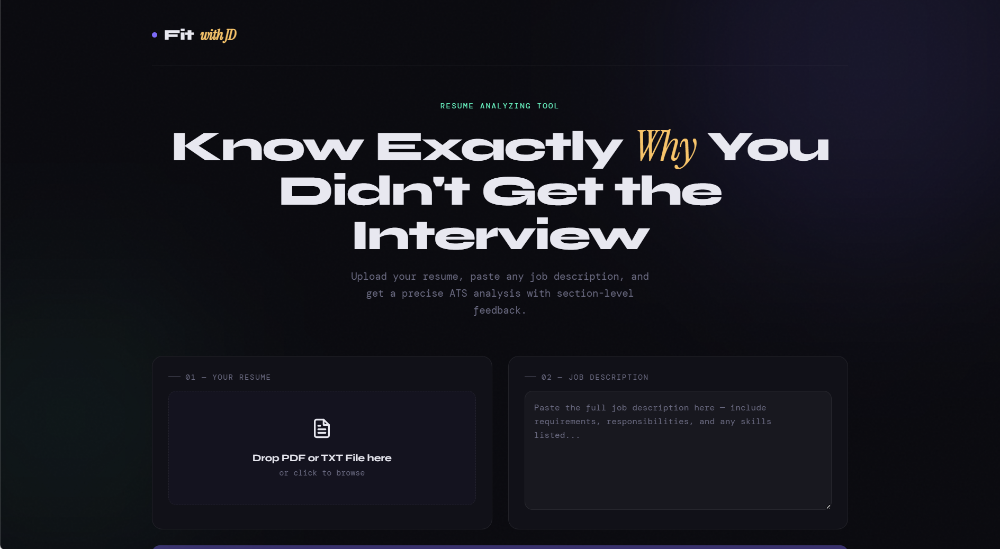

# 🎯 ResumeMatch — AI Resume Analyzer

> Upload your resume, paste a job description, get instant AI-powered ATS analysis with section-level feedback.

## 🔴 Live Demo
**[resumematch.vercel.app](https://resume-analyzer-tau-jade.vercel.app/)**

---

## 📸 Screenshot
<!-- Add a screenshot after deploying -->

---

## ✨ Features

- 📄 PDF & TXT resume upload with drag and drop
- 🤖 AI-powered match scoring (0–100%)
- ✅ Matched skills detection with synonym awareness
- ❌ Missing skills gap analysis  
- 💡 ATS keyword suggestions
- 📊 ATS readability score with breakdown
- 🔍 Section-level analysis — Summary, Skills, Experience, Projects
- ✍️ AI-generated rewrite suggestions per section
- 🌐 Works for ALL roles — Software, HR, Finance, Marketing, Sales, Design and more
- ⬇️ Downloadable analysis report

---

## 🧠 Gen AI Skills Demonstrated

| Skill | How it's used |
|---|---|
| **Prompt Engineering** | Structured multi-rule prompts for reliable JSON output |
| **Semantic Matching** | Synonym + abbreviation aware skill matching (Gen AI = Generative AI) |
| **OR Group Logic** | Any one language/framework from a group = satisfied |
| **Domain Detection** | Auto-detects role domain (HR/Finance/Tech etc.) from JD |
| **Structured Output** | JSON mode forcing reliable parseable AI responses |
| **Document Pipeline** | PDF → text extraction → LLM → structured UI |
| **Multi-domain AI** | Same prompt handles 10+ industry verticals |

---

## 🛠️ Tech Stack

| Layer | Technology |
|---|---|
| **Frontend** | Next.js 14, React 18 |
| **AI Model** | LLaMA 3.3 70B via Groq API |
| **PDF Parsing** | pdf-parse (server-side) |
| **Styling** | CSS-in-JS with custom design system |
| **Deployment** | Vercel |

---

## 🏗️ Architecture

\`\`\`
User uploads PDF
      ↓
/api/extract  →  pdf-parse  →  raw resume text
      ↓
/api/analyze  →  Groq LLaMA 3.3 70B  →  structured JSON
      ↓
React UI renders match score, skills, section feedback
\`\`\`

---

## 🚀 Run Locally

### 1. Clone the repo
\`\`\`bash
git clone https://github.com/YOUR_USERNAME/resume-analyzer.git
cd resume-analyzer
\`\`\`

### 2. Install dependencies
\`\`\`bash
npm install
\`\`\`

### 3. Add your API key
Create a \`.env.local\` file in the root:
\`\`\`
GROQ_API_KEY=your_groq_api_key_here
\`\`\`
Get a **free** API key at [console.groq.com](https://console.groq.com)

### 4. Run the dev server
\`\`\`bash
npm run dev
\`\`\`
Open [http://localhost:3000](http://localhost:3000)

---

## 📁 Project Structure

\`\`\`
resume-analyzer/
├── app/
│   ├── layout.jsx              # Root layout + Google Fonts
│   ├── page.jsx                # Main UI — upload, results, section tabs
│   └── api/
│       ├── extract/
│       │   └── route.js        # PDF → text extraction endpoint
│       └── analyze/
│           └── route.js        # Resume analysis via Groq LLaMA
├── public/
│   └── screenshot.png          # App screenshot for README
├── .env.local                  # Your API key (never committed)
├── .gitignore
├── next.config.js
└── package.json
\`\`\`

---

## 🔑 Environment Variables

| Variable | Description | Where to get |
|---|---|---|
| `GROQ_API_KEY` | Groq API key for LLaMA 3.3 | [console.groq.com](https://console.groq.com) |

---

## 🤝 Contributing

1. Fork the repo
2. Create a branch — `git checkout -b feature/your-feature`
3. Commit — `git commit -m "Add your feature"`
4. Push — `git push origin feature/your-feature`
5. Open a Pull Request

---

## 📄 License

MIT License — free to use, modify and distribute.

---

## 👤 Author

**Sai Sirisha Sabbella**
- GitHub: [@saisiri6803](https://github.com/saisiri6803)
- LinkedIn: [sai-sirisha-sabbella](https://linkedin.com/in/sai-sirisha-sabbella)